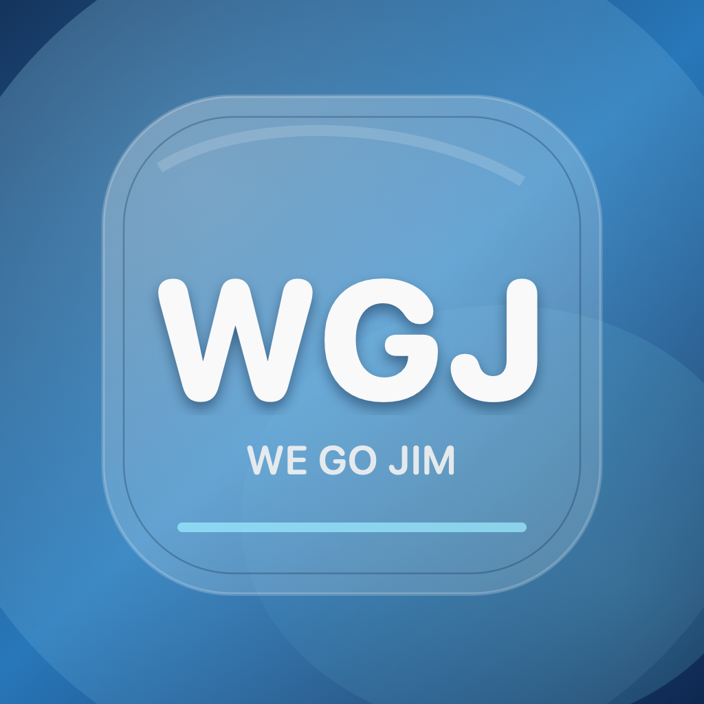
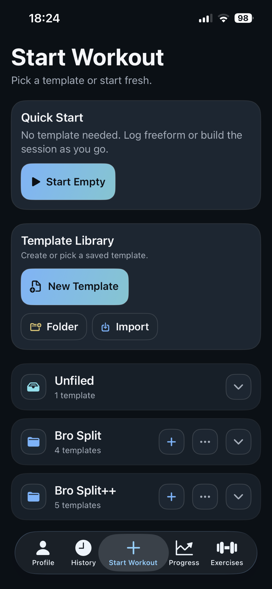
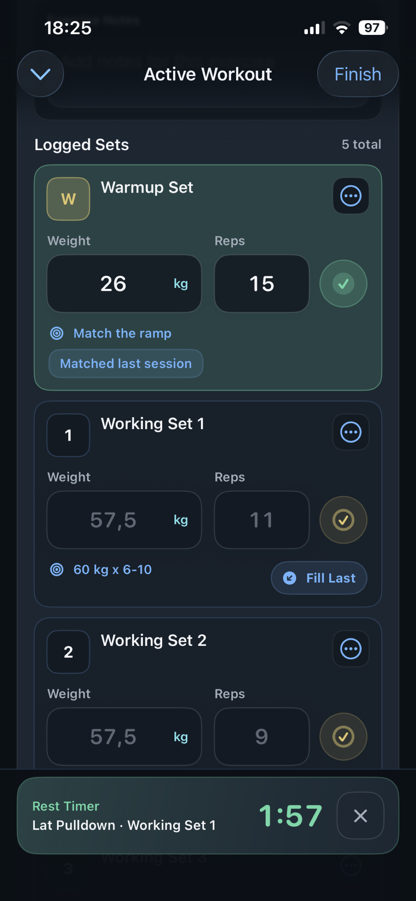
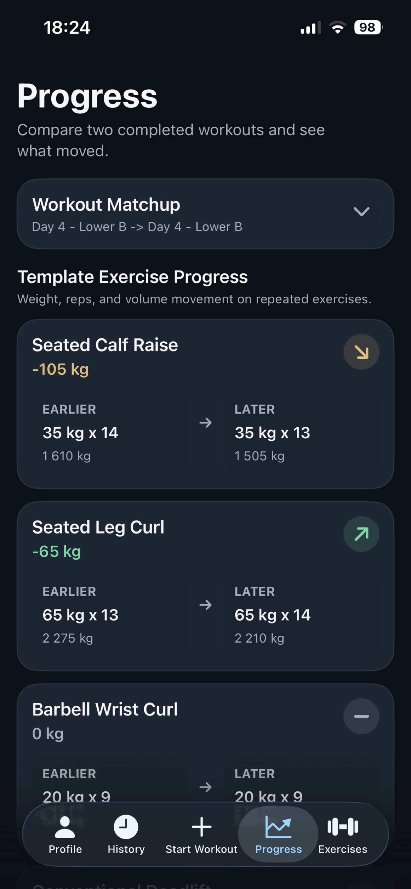

<p align="center">
  
</p>

# We Go Jim

**We Go Jim** is an opinionated native iOS workout app. It is built around how I want to plan, run, finish, review, and back up training, not around being a neutral fitness platform for every possible workflow.

The app is local-first. The important workout loop should work on-device first: templates, active workout progress, completed workouts, profile stats, and history are saved locally. CloudKit is used as a best-effort backup/export boundary after explicit saves, not as a broad background sync engine that can interrupt lifting.

<p align="center">
  
  
  
</p>

## Philosophy

- **Training flow first.** Start a session fast, keep inputs editable, finish cleanly, and review what changed.
- **Local-first by default.** The app should keep working even when iCloud is unavailable, slow, or signed out.
- **Opinionated over generic.** WGJ has features and defaults that match my preferences: templates, dropsets, supersets, cardio blocks, Bozar mode, active workout restore, profile widgets, and lightweight coaching summaries.
- **Quiet infrastructure.** Persistence, cache cleanup, widget publishing, and CloudKit backup should stay out of interaction paths.
- **Open source friendly.** The code is here to inspect, learn from, fork, and improve. Product direction still follows the opinionated app I want to use.

## Features

- Start an empty workout or launch from a saved template.
- Build templates with folders, exercises, targets, notes, rest timers, dropsets, supersets, component rotations, cardio blocks, and Bozar mode.
- Keep active workouts resumable after minimizing the workout, switching tabs, backgrounding, or relaunching the app.
- Log reps and weight directly in active workout cards with local snapshot persistence.
- Browse a bundled exercise catalog, cache exercise images, and create custom exercises.
- Complete workouts into local history with duration, volume, PRs, best sets, muscle maps, and calendar filtering.
- Track profile progress with weekly goals, PRs, muscle heatmaps, streaks, top exercises, consistency, coach summaries, and exercise trend widgets.
- Publish a weekly goal widget from local data.
- Export/import templates and maintain a best-effort CloudKit user-data backup.

## Architecture

WGJ is a SwiftUI app backed by SwiftData.

- **SwiftUI** owns screens, navigation, and native app presentation.
- **SwiftData** is the local source of truth for durable app data.
- **Repositories and services** own persistence, sync boundaries, metrics, backup, cache management, and business rules.
- **Active workout runtime state** is memory-first while the workout is open and local-snapshot backed for restore.
- **CloudKit backup** is explicit-boundary and best-effort. It should not block active workout editing, scrolling, completion, or template work.
- **Widget data** is published from local snapshots into the widget extension.

The main rule: keep views thin. If logic decides how data is saved, restored, synced, projected, or summarized, it belongs in `Services` or model-layer helpers, not inside a SwiftUI body.

## Repository Layout

```text
.
|- WGJ.xcodeproj
|- WGJ-App-Info.plist
|- WGJ/
|  |- Assets.xcassets/        App icon, splash icon, colors
|  |- Models/                 SwiftData models, runtime config, domain enums
|  |- Resources/              Bundled exercise seed data and static resources
|  |- Services/               Repositories, CloudKit backup, metrics, caches, runtime helpers
|  |- Theme/                  Shared styling, buttons, cards, and visual helpers
|  |- Views/
|  |  |- Exercises/           Exercise catalog, filters, custom exercises
|  |  |- History/             Workout history, summaries, detail views
|  |  |- Profile/             Profile dashboard, widgets, settings, backup, support, deletion
|  |  |- Shared/              Reusable SwiftUI components
|  |  |- Templates/           Template library, folders, editors, import/export
|  |  |- Workout/             Start workout, active workout, timers, completion flow
|  |  `- MainTabView.swift    Tab shell and active workout overlay
|  |- WidgetShared/           Shared widget snapshot types
|  |- ContentView.swift       Root app flow and lifecycle routing
|  `- WGJApp.swift            Model container setup and bootstrap
|- WGJWidgetExtension/        Weekly goal widget
`- WGJTests/                  Unit tests for backup and active workout runtime behavior
```

## Running Locally

1. Open `WGJ.xcodeproj` in Xcode.
2. Use `WGJ Dev` for development or `WGJ` for the main app scheme.
3. Configure signing for the app target and widget extension.
4. Build and run on an iPhone simulator or device.

The checked-in Xcode project currently keeps the owner signing setup. Forks should set their own team before building for a physical device or distributing the app.

## Fork Configuration

The checked-in Xcode project still uses WGJ's default app identifiers so the owner build remains reproducible. If you fork the app, replace these values with identifiers you control:

- `PRODUCT_BUNDLE_IDENTIFIER`
- `WGJ_APP_GROUP_IDENTIFIER`
- `WGJ_CLOUDKIT_CONTAINER_IDENTIFIER`
- URL/document type identifiers such as `com.hortlund.wgj.template` if you want your fork to own a different import type

The default CloudKit container is:

```text
iCloud.se.highball.WeGoJim
```

That container identifier is not a credential. It is app-specific Apple entitlement metadata that is visible in signed apps and project settings. Forks need their own container because CloudKit access is controlled by Apple Developer account entitlements, not by secrecy of the identifier.

For CloudKit backup behavior, use a simulator or device signed into an iCloud account and make sure the entitlements match your signing setup.

## Legal Links

The app links to these public pages from Settings:

- Privacy: https://highball.se/wgj/privacy/
- Terms and product site: https://highball.se/wgj/index.html

Forks should replace those links in `AppRuntimeConfig` before distribution.

## Testing

The focused unit test target is `WGJTests`.

Useful local checks:

```sh
xcodebuild test \
  -project WGJ.xcodeproj \
  -scheme "WGJ Dev" \
  -destination 'platform=iOS Simulator,name=iPhone 17' \
  -only-testing:WGJTests
```

```sh
xcodebuild build \
  -project WGJ.xcodeproj \
  -scheme "WGJ Dev" \
  -destination 'platform=iOS Simulator,name=iPhone 17'
```

## Data And Sync Notes

- Active workout edits are staged in memory and written to a local snapshot at safe boundaries.
- Workout completion writes local history and projections first.
- Template mutations save locally first.
- CloudKit backup runs after explicit local saves and is allowed to fail quietly.
- The app should avoid no-op save churn, broad background sync, and main-actor CloudKit work.

## Contributing

This project is open source in spirit: issues, fixes, audits, experiments, and forks are welcome. The app direction is still intentionally personal and opinionated, so not every generic fitness-app feature belongs here.

Good contributions tend to:

- protect active workout input/editing reliability,
- keep persistence local-first,
- move business logic out of SwiftUI views,
- avoid blocking the main actor with sync, image decoding, or heavy projection work,
- improve restore, backup, completion, and scrolling smoothness,
- add focused tests for persistence and data integrity.

## License

WGJ is released under the [MIT License](LICENSE).

You can use, copy, modify, merge, publish, distribute, sublicense, and sell copies of the software, as long as the copyright notice and license notice are kept with copies or substantial portions of the software.
