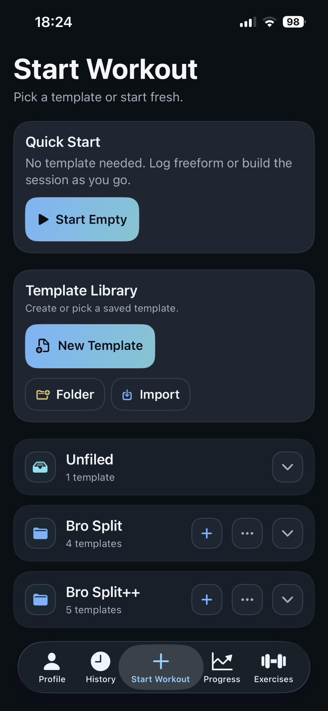
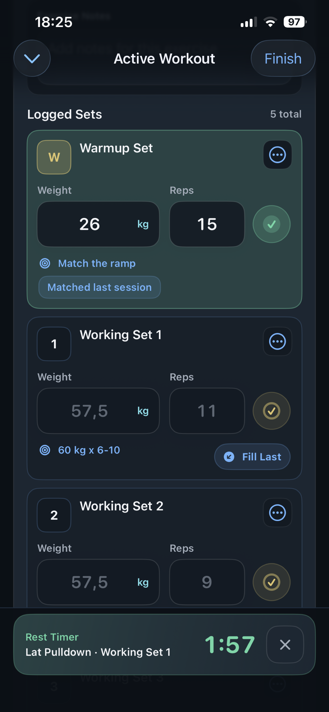
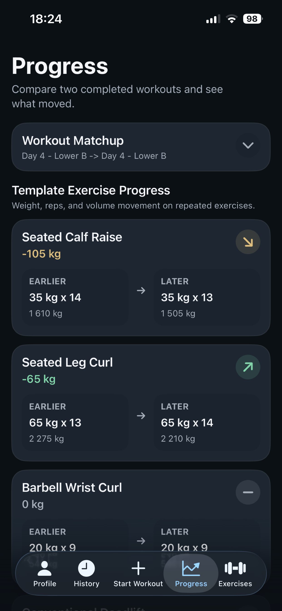

<p align="center">
  
  <br><br>
  <a href="https://apps.apple.com/app/id6760931499">
    
  </a>
</p>

# We Go Jim

**We Go Jim** is an opinionated, native workout tracker for iPhone and iPad. It is built around a focused loop: plan a workout, log it without friction, finish cleanly, and understand what changed.

WGJ is local-first. Templates, active workout progress, completed workouts, profile data, and history are stored on-device with SwiftData. A private CloudKit record provides best-effort backup and restore at explicit save boundaries; it is not used as a live SwiftData sync layer and does not sit in the workout interaction path.

The current deployment target is **iOS/iPadOS 18.0 or later**.

<p align="center">
  
  
  
</p>

## Philosophy

- **Training flow first.** Start a session fast, keep inputs editable, finish cleanly, and review what changed.
- **Local-first by default.** The app should keep working even when iCloud is unavailable, slow, or signed out.
- **Opinionated over generic.** WGJ favors deliberate training workflows such as structured templates, warm-up sets, dropsets, supersets, cardio blocks, active workout restore, and configurable progress widgets.
- **Quiet infrastructure.** Persistence, cache cleanup, widget publishing, and CloudKit backup should stay out of interaction paths.
- **Open source friendly.** The code is here to inspect, learn from, fork, and improve. Product direction still follows the opinionated app I want to use.

## Features

- **Plan reusable workouts.** Organize templates into folders and configure exercise notes, warm-up and working sets, target reps and loads, rest timers, dropsets, two-exercise supersets, rotating exercise components, and ordered cardio blocks.
- **Log without losing context.** Start empty or from a template, apply previous performance, edit the workout structure in place, use optional training guidance, run rest timers with background notifications, and keep the screen awake during active sessions.
- **Resume reliably.** Minimize the active workout while using other tabs, background the app, or relaunch it and restore the locally persisted session, rest timer, and scroll position.
- **Track strength and cardio together.** Cardio activities support warm-up, main, and finisher roles; time, distance, or open goals; live timers; and derived pace, speed, or rowing split metrics where applicable.
- **Keep templates in step with real training.** Save an improvised workout as a new template or review a structured diff before applying workout changes back to its source template.
- **Review useful completion data.** See duration, working and warm-up sets, training volume, estimated active calories, muscle emphasis, best sets, and personal-record highlights, then render a shareable workout card.
- **Explore exercises.** Search and filter a bundled 247-exercise catalog, use the interactive muscle map, cache exercise media, and create custom strength or cardio exercises.
- **Inspect history and progress.** Browse workouts by calendar, edit completed entries, inspect exercise history, and compare any two compatible completed workouts across exercise and session metrics.
- **Customize the profile dashboard.** Configure weekly goals, PRs, streaks, top exercises, consistency calendars, muscle heatmaps, and per-exercise trends for estimated 1RM, max weight, max reps, and volume.
- **Get a private coach brief.** Weekly summaries and follow-up prompts use Apple's on-device Foundation Models when available, with deterministic local summaries as the fallback.
- **Use the Home Screen widget.** The widget reads a local app-group snapshot of weekly goal progress and deep-links back to the relevant profile section.
- **Move and protect data.** Import or export templates as `.wgjtemplate` or JSON files, and use explicit best-effort backup and restore through the user's private CloudKit database.

## Architecture

WGJ uses SwiftUI, Swift 6, and SwiftData. The app and widget target iPhone and iPad.

- **SwiftUI** owns screens, navigation, adaptive presentation, and accessibility behavior.
- **SwiftData** is split into local catalog, user data, active workout draft, and history projection stores. None of these configurations use automatic SwiftData CloudKit sync.
- **Repositories and services** own persistence, backup boundaries, metrics, projections, cache management, and business rules.
- **Active workout state** is memory-first while open and snapshot-backed for crash/relaunch recovery.
- **Background projections** keep history analytics, profile metrics, and coach inputs away from hot editing and scrolling paths.
- **CloudKit backup** serializes user data into one record in the user's private database. Local commits succeed independently of backup availability.
- **WidgetKit** reads a compact weekly-goal snapshot from the shared app group instead of querying the main stores.
- **Foundation Models** optionally generates private coach copy on supported systems; the feature has a non-generative fallback.
- **MuscleMap** is the only Swift Package dependency and provides the interactive body-map rendering.

The main rule: keep views thin. If logic decides how data is saved, restored, synced, projected, or summarized, it belongs in `Services` or model-layer helpers, not inside a SwiftUI body.

## Repository Layout

```text
.
|- AppStoreScreenshots/       Store and README screenshots
|- Configuration/             Shared release-like Xcode settings
|- WGJ.xcodeproj
|- WGJ-App-Info.plist
|- WGJ/
|  |- Assets.xcassets/        Production/dev icons, splash art, colors
|  |- Models/                 SwiftData models, runtime config, domain enums
|  |- PreviewSupport/         In-memory SwiftUI preview container
|  |- Resources/              Bundled exercise seed data and static resources
|  |- Services/               Repositories, CloudKit backup, metrics, projections, runtime helpers
|  |- Theme/                  Shared styling, buttons, cards, and visual helpers
|  |- Views/
|  |  |- Exercises/           Exercise catalog, filters, custom exercises
|  |  |- History/             Workout history, summaries, detail views
|  |  |- Profile/             Profile dashboard, widgets, settings, backup, support, deletion
|  |  |- Progress/            Completed-workout comparison dashboard
|  |  |- Shared/              Reusable SwiftUI components
|  |  |- Templates/           Template library, folders, editors, import/export
|  |  |- Workout/             Start workout, active workout, timers, completion flow
|  |  `- MainTabView.swift    Tab shell and active workout overlay
|  |- WidgetShared/           Shared widget snapshot types
|  |- ContentView.swift       Root app flow and lifecycle routing
|  `- WGJApp.swift            Model container setup and bootstrap
|- WGJWidgetExtension/        Weekly goal widget
|- WGJTests/                  Persistence, domain, projection, layout, and policy tests
`- WGJUITests/                Adaptive-layout and deep-link accessibility tests
```

## Requirements

- Xcode 26 is recommended for the current project and optional Foundation Models support.
- The app deployment target is iOS/iPadOS 18.0.
- Swift Package Manager access is required once to resolve [MuscleMap](https://github.com/melihcolpan/MuscleMap), currently pinned through `Package.resolved`.
- A personal Apple development team is required for device builds and for CloudKit, app-group, notification, and widget capabilities in a fork.

## Running Locally

1. Open `WGJ.xcodeproj` in Xcode.
2. Select `WGJ Dev` for normal development. Its Run action uses the `Dev Preview` configuration and separate development identifiers.
3. Configure signing for both the app and widget extension if Xcode cannot use the checked-in owner team.
4. Build and run on an iPhone simulator or device.

The `WGJ` scheme uses the production identifiers and Release configuration. Avoid running or archiving that scheme unchanged from a fork.

## Fork Configuration

The checked-in project keeps WGJ's owner signing team and production/development identifiers so official builds remain reproducible. Forks should replace the corresponding values for both the app and widget targets:

- `DEVELOPMENT_TEAM`
- `PRODUCT_BUNDLE_IDENTIFIER`
- `WGJ_APP_GROUP_IDENTIFIER`
- `WGJ_CLOUDKIT_CONTAINER_IDENTIFIER`
- `WGJ_URL_SCHEME`
- `WGJ_APP_DISPLAY_NAME` and `WGJ_APP_ENVIRONMENT` where appropriate
- The exported document type `com.hortlund.wgj.template` if the fork should own a distinct import format

The default CloudKit container is:

```text
iCloud.se.highball.WeGoJim
```

That container identifier is not a credential. It is app-specific Apple entitlement metadata that is visible in signed apps and project settings. Forks need their own container because CloudKit access is controlled by Apple Developer account entitlements, not by secrecy of the identifier.

Enable the iCloud/CloudKit, App Groups, and notification capabilities for the replacement identifiers in the Apple Developer portal. To exercise backup and restore, run on a simulator or device signed into iCloud and make sure the entitlements match the selected build configuration.

## Legal Links

The app links to these public pages from Settings:

- [Privacy policy](https://highball.se/wgj/privacy/)
- [Terms and product site](https://highball.se/wgj/index.html)
- [Support and issue tracker](https://github.com/Hortlund/we-go-jim/issues)

Forks should replace these URLs in `AppRuntimeConfig` before distribution.

## Testing

The `WGJ Dev` scheme includes both `WGJTests` and `WGJUITests`. The unit suite covers persistence boundaries, active workout restore, templates, CloudKit payloads and restore behavior, cardio, calories, metrics, projections, app routing, settings, adaptive layout policies, strict concurrency, and widget content. The UI suite covers adaptive layouts and deep-link accessibility flows.

Run the unit suite:

```sh
xcodebuild test \
  -project WGJ.xcodeproj \
  -scheme "WGJ Dev" \
  -destination 'platform=iOS Simulator,name=iPhone 17,OS=latest' \
  -only-testing:WGJTests
```

Run the UI suite by replacing the final selector with `-only-testing:WGJUITests`. Replace the simulator name if that device is not installed locally.

For a compile-only simulator check:

```sh
xcodebuild build \
  -project WGJ.xcodeproj \
  -scheme "WGJ Dev" \
  -destination 'generic/platform=iOS Simulator'
```

## Data And Sync Notes

- The exercise catalog, user data, active workout draft, and history projection each use a separate local SwiftData configuration.
- Active workout edits are staged in memory and checkpointed to the dedicated local draft store at controlled boundaries.
- Workout completion commits the local session and history projection before scheduling backup work.
- Template, profile, settings, exercise, and history mutations commit locally before scheduling best-effort backup.
- Startup checks fetch lightweight backup metadata; they do not replace local data or start broad background synchronization.
- Restore is an explicit user action and is committed through a local restore transaction.
- CloudKit operations run outside interaction-critical view work and may degrade without blocking local use.
- Widget publication uses a local snapshot in the app group and does not depend on CloudKit.

## Contributing

This project is open source in spirit: issues, fixes, audits, experiments, and forks are welcome. The app direction is still intentionally personal and opinionated, so not every generic fitness-app feature belongs here.

Good contributions tend to:

- protect active workout input/editing reliability,
- keep persistence local-first,
- move business logic out of SwiftUI views,
- avoid blocking the main actor with sync, image decoding, or heavy projection work,
- improve restore, backup, completion, and scrolling smoothness,
- add focused tests for persistence and data integrity.

## License

WGJ is released under the [MIT License](LICENSE).
